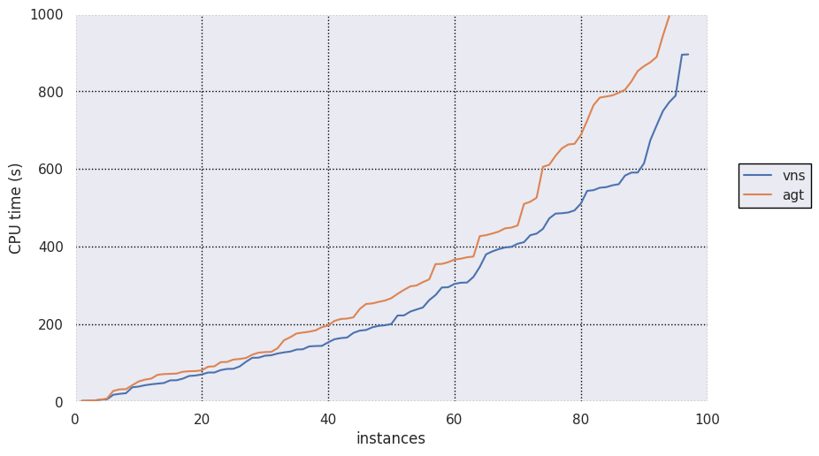

# Cactus Plot

A Python script to quickly create cactus and scatter plots.

It generates plots from either json data in a specified, but simple to obtain format; or directly
from the datase used in the iProver group. The data loader can quickly be adapted to support other
databases or file formats.


## Getting Started

Python3 and matplotlib is required.
For some of the options seaborn and multiple latex packages are required.

## Usage

The script implements argparse so to inspect program arguments, run:

```
python3 mkplot.py -h
```

### Input Format

The data to plot can be given in one of the two formats:

* [JSON Files](https://en.wikipedia.org/wiki/JSON)
* JSON string specifying the databse experiments
 

#### JSON Files
The format of the json files should be as follows;


```json
{
	"preamble": {
		"program": "program-name",
		"prog_alias": "some-short-alias-to-use-in-the-plot",
	},
	"stats": {
		"some_problem_instance": {
			"status": true,
			"rtime": 10.567
		},
		"another_problem_instance": {
			"status": false,
			"rtime": 1000.00
		}
	}
}
```


Here, the data describes the result of running a tool referred to as *"program-name", containing three problem instances.
The result for each instance **must** have the information on its status: *true* or *false* meaning that the instance is solved or unsolved,
respectively. All the other fields are non-mandatory (you can use whatever key/value you want). 
However, note that the *rtime* key is used by default when working with JSON files (to change this use the `-k` option).

For more details on the JSON files, see the [example files](examples).

#### JSON Strings

These string is a dictionary mapping of the experiment_id-alias value pairs in the database.
They should in the following format:`{"id1": "alias1", "id2": "alias2"}`.

An example is: `{"12897": "iprover_inst", "12904": "iprover_sup"}`.

If the set of experiments are ran in the LTB context, set the `--db_data_ltb` when calling the script.i


## Using mkplot

### Cactus Plot

For instance, running

```
mkplot.py --legend prog_alias -t 1000 -b png --save-to examples/cactus.png examples/solver?.json
```

results in a simple cactus plot showing the performance of `very-nice-solver` and `another-good-tool`: 

Here, mkplot is set to show program aliases in the legend instead of their complete names.

### Scatter Plot
If you need to create a scatter plot detailing the metric difference between the instances solved by both solver, just do;

```
mkplot.py -p scatter -b png --save-to examples/scatter.png --shape squared -t 1000 --ylog --ymax 10000 --ymin 0.1 --xlog examples/solver?.json
```

The resulting scatter plot is the following:


## License

This project is licensed under the MIT License - see the [LICENSE](LICENSE) file for details.
